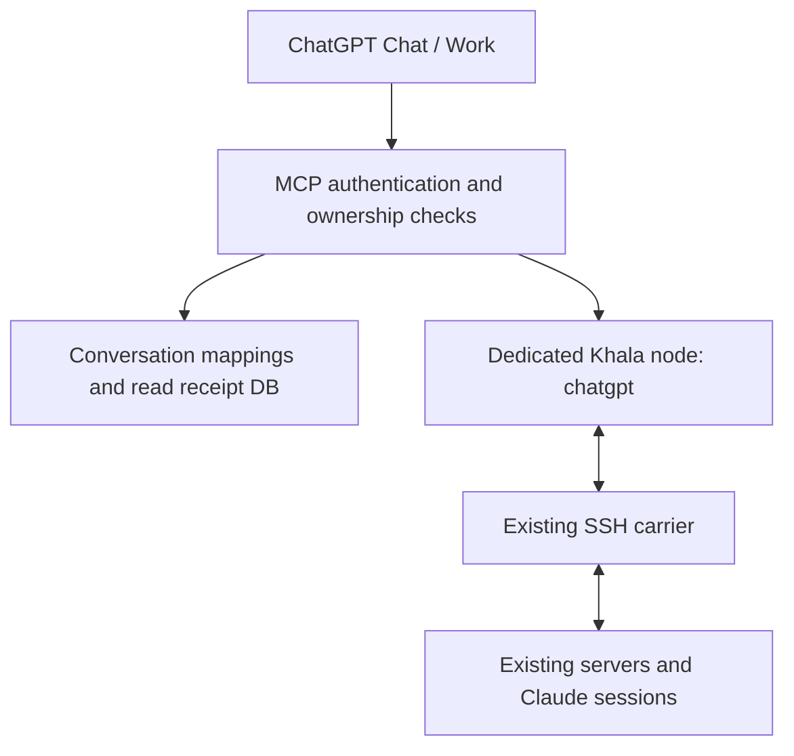

# Khala Network for ChatGPT

An MCP server and plugin that adds ChatGPT mailboxes to an existing [khala-network](https://github.com/Dev-Jahn/khala-network). Existing Claude sessions send mail as usual, and ChatGPT reads its mailbox when the user asks. The integration does not depend on autonomous wake, Claude hooks, or the Channels API.

## Implemented features

| Tool | Behavior |
|---|---|
| `khala_session_open` | Create or reuse a mailbox for a conversation, or resume an owned mailbox |
| `khala_fleet_list` | Query presence on the existing network |
| `khala_inbox_list` | List unread messages with pagination cursors |
| `khala_message_read` | Read a message body in pages and issue a read receipt on the final page |
| `khala_inbox_ack_read` | Mark only the messages identified by the receipts as read |
| `khala_message_send` | Send ordinary mail using a fixed sender address and a retry key |
| `khala_message_status` | Check the outgoing queue and delivery to the recipient node's disk |

Listing and reading do not consume messages in `new`. Messages move to `cur` only after explicit acknowledgement following a read of all pages. Reusing the same send key and content after a timeout returns the same Khala Id. A network ACK means delivery to disk; it does not confirm that the message was read or the task was completed.

This version does not include streams/minds, attachments, signed operator commands, automatic polling, or wake. It focuses on ordinary messages and reading mail already received.

## Architecture



Use a dedicated OS account and a dedicated `KHALA_HOME`. Do not expose an existing Claude user's directory directly to the MCP server. New addresses take the form `gpt-chat-<8 hex digits>@<node>` or `gpt-work-<8 hex digits>@<node>` and do not impersonate an existing process or Claude registration.

`khala_session_open` accepts `client_mode="chat"` (default) or `client_mode="work"`. The caller supplies its known surface; the server does not infer Chat/Work from a user-agent string. When the surface is unknown, the default is Chat. The suffix is a random eight-digit hexadecimal identifier, with collision detection and retries inside the allocation transaction. It is not an authentication secret.

The prefix records the surface at creation, not a live presence signal. Reopening a conversation, switching its mode, restarting the bridge, or explicitly resuming a mailbox preserves its address. Existing `cg-...` addresses, mail, read receipts and retry records remain valid and are not renamed. The new format applies to newly created mailboxes after updating and restarting the bridge; refresh the connection's tool schema so callers can pass `client_mode`.

HTTP mode identifies users by their verified OAuth `issuer + sub`. The `openai/session` value distinguishes conversations only and does not confer authorization. Hosts without this metadata use an explicit `conversation_key`.

### Hosting the chatgpt node on an existing hub machine

The physical host and Khala node name are independent. A Mac mini can host both the existing `mini` hub and a separate `chatgpt` node. Give the new node its own `KHALA_HOME`, config with `self chatgpt`, bridge `state_dir`, and carrier process connected to the existing hub. New addresses will then be `gpt-chat-<8 hex digits>@chatgpt` or `gpt-work-<8 hex digits>@chatgpt`. Keep the existing hub's identity and carrier unchanged; never run two carriers against the same home.

The bridge derives the address suffix from the configured Khala node. Do not rewrite only the displayed suffix: envelopes, routing and recipient checks must agree. Node separation is logical; OS isolation additionally requires separate service accounts and appropriate filesystem permissions.

For a deployment that already created `cg-...@mini` mailboxes, initialize the new node with a fresh bridge state directory. Preserve the old database, mail and retry records. Changing `khala_home` while reusing the old database is not a mailbox migration. Old addresses stay on `mini` and are not automatically forwarded or exposed through the new node's bridge. Open a new mailbox after switching the connection; continue accessing old mail through the old deployment if needed. A transfer of old mail or address forwarding requires a separate migration procedure.

## Prerequisites

- Python 3.11 or later, Bash, and the standard Unix tools used by Khala.
- The Khala compatibility commit pinned in [compatibility.json](compatibility.json). The server will not start with unmodified v0.9.4.
- The existing Khala carrier binary, `khala-link`, and SSH access to the existing network.
- A Secure MCP Tunnel dedicated to one user, or HTTPS with an OAuth authorization server.

Only the ChatGPT node's CLI needs the compatibility changes. The message format and carrier protocol remain compatible, so the changes do not need to be deployed across all eight existing servers.

```bash
python3 -m venv .venv
.venv/bin/python -m pip install -e '.[test]'
```

Use the commit specified in `compatibility.json` in your Khala checkout, and verify that `khala capabilities` reports both `send_request_id` and `inbox_ack_read` as 1. The full Khala source is not duplicated in this repository.

## Connecting to the network

Set the deployment account's home directory to `/var/lib/khala-chatgpt`, then run the following once as that account.

```bash
KHALA_HOME=/var/lib/khala-chatgpt/.khala /opt/khala-network/bin/khala init chatgpt
```

Configure the generated Khala config to connect to an actual existing mailbox node and SSH destination. For example, if the existing mailbox alias is `hub`, use the following structure. Replace `hub` and `khala-hub` with the aliases used in your deployment.

```text
self chatgpt
peer chatgpt chatgpt
peer hub khala-hub
mailbox hub
ttl 120
retain 30
ears off
```

The `khala-hub` destination is defined in this dedicated account's SSH config. Configure keys and known_hosts locally so that `ssh -T -o BatchMode=yes khala-hub true` succeeds as that account. Update the existing mailbox and peer declarations according to your network's procedure for joining a new node. Do not commit production server settings or keys to this repository.

Install `khala-link` at `.khala/bin/khala-link` or in the same directory as the CLI. The [carrier service](deploy/khala-chatgpt-link.service) keeps `khala link` running in the foreground. This connects the new node without creating a Claude conduit registration.

## Personal use: Secure MCP Tunnel

Copy `config.stdio.example.toml` to `/etc/khala-chatgpt/config.toml` on the server and adjust the paths for your deployment. The `local_principal` value is the fixed owner name for this personal connection, not a password. This profile is **for one user only**; anyone sharing the connection operates under the same ownership. Use the OAuth mode below to serve multiple users.

```bash
.venv/bin/khala-chatgpt check --config /etc/khala-chatgpt/config.toml
```

Follow the [OpenAI Tunnel setup instructions](https://developers.openai.com/api/docs/guides/secure-mcp-tunnels) to create a tunnel associated with your personal organization and the ChatGPT workspace you intend to use. Configure `tunnel-client` on the server with the following stdio command.

```text
/opt/khala-network-chatgpt/.venv/bin/khala-chatgpt serve --config /etc/khala-chatgpt/config.toml
```

Inject the tunnel runtime key through the server's secret store or service credentials. In ChatGPT's developer connection settings, select Tunnel under Connection. Both tunnel-client and the Khala carrier must keep running on the server. This mode does not require an OAuth server for the bridge or a public inbound port. The tunnel runtime key serves a different purpose from a key used for model generation API calls.

## HTTPS + OAuth

Fill in `config.example.toml` with your deployment values. You need a public `/mcp` URL, the exact issuer, a fixed JWKS URL, and the permitted users' `sub` values. The bridge checks the token signature, `iss`, `aud`, `sub`, `iat`, `exp`, and tool-specific scopes. It does not support HS256, unsigned JWTs, discovery of arbitrary issuers, or forwarding tokens to Khala.

The OAuth authorization server must provide the following.

- Authorization Code with PKCE S256, OAuth/OIDC discovery, and a client registration method that ChatGPT can use.
- An access token whose `aud` is the MCP server's **exact `resource_url`**. The token must be a JWT signed with the configured asymmetric algorithm.
- The `khala:connect`, `khala:read`, `khala:send`, `khala:ack`, and `khala:fleet` scopes. Grant only the permissions needed.
- Registration of the exact redirect URI shown in ChatGPT's connection settings. Do not guess the callback URL.

This repository implements an OAuth **resource server**. Your chosen OAuth authorization server and ChatGPT's connection management handle user login, refresh token rotation, and client secret storage. This repository does not include its own password entry page or a separate OAuth authorization server. See the [OpenAI authentication requirements](https://developers.openai.com/plugins/build/auth).

The repository includes `deploy/khala-chatgpt.service` and a TLS reverse proxy example. By default, the bridge binds only to `127.0.0.1:8765`. Serve `/mcp` and `/.well-known/oauth-protected-resource/mcp` through the same HTTPS host. Do not log Authorization headers at the proxy, and configure request limits appropriate for your production traffic. The [Caddy request body limit](https://caddyserver.com/docs/caddyfile/directives/request_body) example uses 1 MB.

## Packaging the ChatGPT plugin

The `.mcp.json` at the repository root is a development default that uses an installed local executable. ChatGPT on the web does not run this stdio command directly.

First, register an HTTPS MCP endpoint or Tunnel as a [ChatGPT developer connection](https://developers.openai.com/plugins/deploy/connect-chatgpt). You can then build a package using the connection's `plugin_asdk_app_...` technical ID.

```bash
python3 scripts/package-plugin.py --app-id plugin_asdk_app_YOUR_CONNECTION --output dist/khala-network-chatgpt.zip
```

To build a deployment package that references an HTTPS MCP endpoint directly, run:

```bash
python3 scripts/package-plugin.py --mcp-url https://YOUR_HOST/mcp --output dist/khala-network-chatgpt.zip
```

Both options package only the manifest and Khala usage skill, excluding server configuration, keys, and databases. Connect the generated package through a local or team marketplace following the [official plugin packaging instructions](https://developers.openai.com/plugins/build/plugins). Verify connection availability in Chat/Work and on desktop/web for your account and workspace settings. Submission to the public directory is a separate step.

After connecting, verify a production round trip: ask "Open my Khala mailbox and tell me its address," send a message to that address from an existing Claude session, then ask "Read my mailbox." This repository's tests do not send messages to production servers or ChatGPT accounts.

## Credential and state storage

| Item | Storage and handling |
|---|---|
| SSH private keys for the existing network | The dedicated server account's `.ssh`, with files at mode 0600 and directories at mode 0700. Never pass them as MCP arguments |
| OAuth access/refresh tokens | ChatGPT's connection management and the authorization server. The bridge validates tokens during requests without storing them in its database or logs |
| JWKS | Public verification keys, fetched and cached only from the URL configured on the server |
| Tunnel runtime key | The server's secret store or service credentials. Never include it in the manifest or Git |
| Mailbox mappings, send fingerprints, and receipt signing key | `state_dir/bridge.sqlite3`, with the directory at mode 0700 and the file at mode 0600 |
| Mail and send retry records | The dedicated `KHALA_HOME`, using the existing mailbox permissions |

Back up the database and Khala directory together in a consistent state to preserve conversation mappings and retry history. Disk and backup encryption are provided by the server's operational infrastructure. Rotating the receipt signing key invalidates existing page cursors and read receipts, requiring messages to be read again.

Send retry records are retained independently of outbox retention and contain the original message content. Deleting them can allow the same key to send again, so operators should remove them only when the corresponding client will no longer retry. Keep deployment logging configured to exclude message bodies and Authorization headers.

## Validation

```bash
KHALA_TEST_BIN=/absolute/path/to/patched/khala .venv/bin/python -m pytest -q
```

The tests create temporary Khala nodes and use the actual CLI and MCP stdio/HTTP transports. Delivery is verified through local reconciliation. The production SSH carrier, OAuth login UX, and actual ChatGPT connection must be verified separately after deployment.

Run the compatibility CLI tests in the upstream repository with `python3 test/mailbox-compat.py`. Together, the test suites verify message page chaining, rejection of forged read receipts and reuse by other users, token validation, tool permission separation, concurrent send retries, and recovery after restart.
