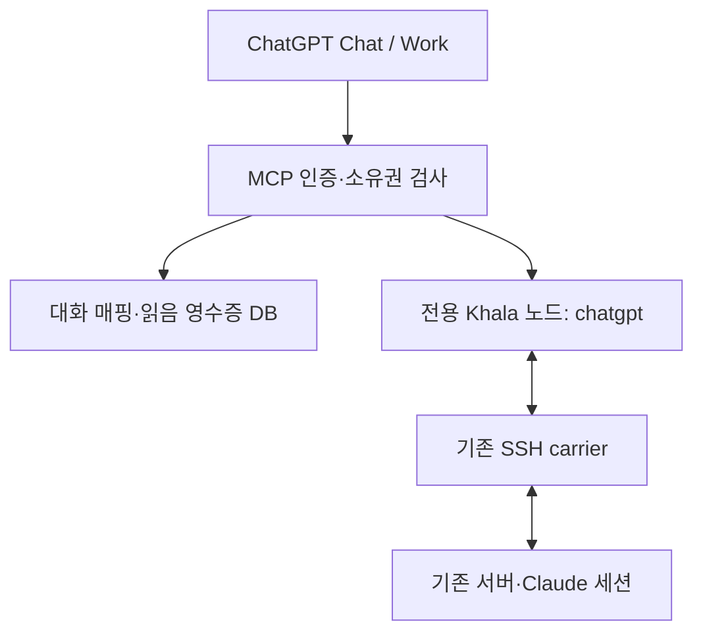

# Khala Network for ChatGPT

기존 [khala-network](https://github.com/Dev-Jahn/khala-network)에 ChatGPT용 편지함을 추가하는 MCP 서버와 플러그인입니다. 기존 Claude 세션들은 평소처럼 편지를 보내고, ChatGPT는 사용자가 요청할 때 편지함을 읽습니다. 자율 wake, Claude hooks, Channels API에 의존하지 않습니다.

## 구현 범위

| 도구 | 동작 |
|---|---|
| `khala_session_open` | 대화별 편지함 생성·재사용, 소유한 편지함 이어받기 |
| `khala_fleet_list` | 기존 네트워크 presence 조회 |
| `khala_inbox_list` | 미확인 편지 목록과 페이지 커서 |
| `khala_message_read` | 본문을 나누어 읽고 마지막 페이지에서 읽음 영수증 발급 |
| `khala_inbox_ack_read` | 영수증에 해당하는 편지만 읽음 처리 |
| `khala_message_send` | 고정 발신 주소, 재시도 키를 사용하는 일반 편지 송신 |
| `khala_message_status` | 송신 큐·수신 노드 디스크 도착 상태 확인 |

조회·읽기는 `new`를 소비하지 않습니다. 모든 페이지를 읽은 뒤 명시적으로 확정해야 `cur`로 이동합니다. 타임아웃 뒤 같은 송신 키와 내용을 재사용하면 같은 Khala Id를 돌려줍니다. 네트워크 ACK는 디스크 도착을 뜻하며, 읽음이나 작업 완료를 뜻하지 않습니다.

Streams/minds, 첨부 파일, signed operator 명령, 자동 폴링·wake는 이번 버전에 포함하지 않습니다. 일반 메시지와 기존 받은 편지의 조회에 집중합니다.

## 구조



전용 OS 계정과 전용 `KHALA_HOME`을 사용합니다. 기존 Claude 사용자의 디렉터리를 MCP 서버에 직접 노출하지 않습니다. ChatGPT 주소는 `cg-<random>@chatgpt` 형태이며 실제 프로세스나 Claude 등록을 가장하지 않습니다.

HTTP 모드는 검증된 OAuth `issuer + sub`를 사용자 식별자로 사용합니다. `openai/session`은 대화 구분에만 쓰며 권한 근거가 아닙니다. 메타데이터가 없는 호스트에서는 명시적인 `conversation_key`를 사용합니다.

## 설치 전제

- Python 3.11 이상, Bash와 Khala가 사용하는 기본 Unix 도구.
- [compatibility.json](compatibility.json)에 고정한 Khala 호환 커밋. 기존 v0.9.4만으로는 서버가 시작되지 않습니다.
- 기존 Khala carrier 바이너리 `khala-link`와 기존 네트워크로 접속 가능한 SSH 경로.
- 개인 전용 Secure MCP Tunnel 또는 HTTPS와 OAuth 발급 서버.

호환 변경은 ChatGPT 노드의 CLI에만 필요합니다. 메시지 포맷과 carrier 프로토콜을 바꾸지 않으므로 기존 8개 서버 전체에 배포할 필요는 없습니다.

```bash
python3 -m venv .venv
.venv/bin/python -m pip install -e '.[test]'
```

Khala checkout에서 `compatibility.json`의 커밋을 사용하고, `khala capabilities`가 `send_request_id`와 `inbox_ack_read`를 모두 1로 보고하는지 확인하세요. 전체 Khala 소스는 이 저장소에 복제하지 않습니다.

## 네트워크 연결

배포 계정의 홈을 `/var/lib/khala-chatgpt`로 두고, 그 계정으로 다음을 한 번 실행합니다.

```bash
KHALA_HOME=/var/lib/khala-chatgpt/.khala /opt/khala-network/bin/khala init chatgpt
```

생성된 Khala config에 실제 기존 우체통 노드와 SSH 대상을 연결합니다. 예를 들어 기존 우체통 별칭이 `hub`라면 다음 구조입니다. `hub`와 `khala-hub`는 실제 운영 별칭으로 바꾸세요.

```text
self chatgpt
peer chatgpt chatgpt
peer hub khala-hub
mailbox hub
ttl 120
retain 30
ears off
```

`khala-hub`는 이 전용 계정의 SSH config에 등록한 접속 대상입니다. 해당 계정에서 `ssh -T -o BatchMode=yes khala-hub true`가 성공하도록 키와 known_hosts를 로컬에서 설정합니다. 기존 우체통과 peer 선언은 현재 네트워크의 참여 절차에 맞춰 갱신합니다. 실제 서버의 설정이나 키를 이 저장소에 커밋하지 마세요.

`khala-link`는 `.khala/bin/khala-link` 또는 CLI와 같은 디렉터리에 설치합니다. [carrier service](deploy/khala-chatgpt-link.service)는 foreground `khala link`를 유지합니다. 새 노드만 연결하는 것이며 Claude conduit 등록은 하지 않습니다.

## 개인용: Secure MCP Tunnel

`config.stdio.example.toml`을 서버의 `/etc/khala-chatgpt/config.toml`로 복사하고 실제 경로를 맞춥니다. `local_principal`은 비밀번호가 아닌, 이 개인 연결의 고정 소유자 이름입니다. 이 프로필은 **한 사용자 전용**이며 연결을 공유하면 같은 소유권으로 동작합니다. 여러 사용자에게 제공하려면 아래 OAuth 모드를 사용하세요.

```bash
.venv/bin/khala-chatgpt check --config /etc/khala-chatgpt/config.toml
```

[OpenAI Tunnel 설정 절차](https://developers.openai.com/api/docs/guides/secure-mcp-tunnels)에 따라 개인 조직과 사용할 ChatGPT workspace를 연결한 터널을 생성합니다. 서버에서 `tunnel-client`의 stdio 명령을 다음으로 설정합니다.

```text
/opt/khala-network-chatgpt/.venv/bin/khala-chatgpt serve --config /etc/khala-chatgpt/config.toml
```

터널 런타임 키는 서버의 비밀 저장소·서비스 credential로 주입합니다. ChatGPT의 개발자 연결에서 Connection을 Tunnel로 선택합니다. 서버 쪽 tunnel-client와 Khala carrier가 계속 실행되어야 합니다. 이 모드에는 브리지용 OAuth 서버나 공개 수신 포트가 필요하지 않습니다. 터널 런타임 키는 생성 API 호출을 위한 키와 별도 용도입니다.

## HTTPS + OAuth

`config.example.toml`을 실제 값으로 채웁니다. 공개 `/mcp` 주소, 정확한 issuer, 고정 JWKS URL, 허용할 사용자 `sub`가 필요합니다. 토큰의 서명, `iss`, `aud`, `sub`, `iat`, `exp`와 도구별 scope를 검사합니다. HS256, unsigned JWT, 임의 issuer 탐색, 토큰을 Khala로 전달하는 동작은 지원하지 않습니다.

OAuth 발급 서버는 다음을 제공해야 합니다.

- Authorization Code + PKCE S256, OAuth/OIDC discovery 및 ChatGPT가 사용할 client 등록 방식.
- access token의 `aud`를 MCP의 **정확한 `resource_url`**로 설정. 토큰은 설정한 비대칭 알고리즘으로 서명된 JWT여야 합니다.
- `khala:connect`, `khala:read`, `khala:send`, `khala:ack`, `khala:fleet` scope. 필요한 권한만 발급할 수 있습니다.
- ChatGPT 연결 화면에 표시되는 정확한 redirect URI 등록. 추측한 callback URL을 사용하지 않습니다.

이 저장소는 OAuth **resource server**를 구현합니다. 사용자 로그인, refresh token 회전, client secret 보관은 선택한 OAuth 발급 서버와 ChatGPT 연결 관리에서 처리합니다. 자체 비밀번호 입력 페이지나 별도 OAuth 발급 서버는 포함하지 않습니다. [OpenAI 인증 요구사항](https://developers.openai.com/plugins/build/auth)을 함께 확인하세요.

`deploy/khala-chatgpt.service`와 TLS reverse proxy 예시를 제공합니다. 브리지는 기본적으로 `127.0.0.1:8765`에만 바인딩합니다. `/mcp` 및 `/.well-known/oauth-protected-resource/mcp`를 같은 HTTPS 호스트로 전달하세요. proxy에서 Authorization을 로그에 남기지 말고, 운영 트래픽에 맞는 요청 제한을 설정하세요. [Caddy 본문 크기 제한](https://caddyserver.com/docs/caddyfile/directives/request_body) 예시는 1 MB입니다.

## ChatGPT 플러그인 패키징

저장소 루트의 `.mcp.json`은 설치된 로컬 실행 파일을 사용하는 개발용 기본값입니다. ChatGPT 웹이 이 stdio 명령을 직접 실행하는 구조는 아닙니다.

먼저 [ChatGPT 개발자 연결](https://developers.openai.com/plugins/deploy/connect-chatgpt)에 HTTPS MCP 또는 Tunnel을 등록합니다. 생성된 연결의 `plugin_asdk_app_...` 기술 ID로 패키지를 만들 수 있습니다.

```bash
python3 scripts/package-plugin.py --app-id plugin_asdk_app_YOUR_CONNECTION --output dist/khala-network-chatgpt.zip
```

직접 HTTPS MCP를 참조하는 배포 패키지는 다음과 같이 생성합니다.

```bash
python3 scripts/package-plugin.py --mcp-url https://YOUR_HOST/mcp --output dist/khala-network-chatgpt.zip
```

두 방식 모두 manifest와 Khala 사용 스킬만 포함하며 서버 설정·키·DB를 포함하지 않습니다. 생성된 패키지는 [공식 플러그인 패키징 절차](https://developers.openai.com/plugins/build/plugins)에 따라 로컬/팀 marketplace에서 연결합니다. Chat/Work 및 desktop/web의 연결 노출 여부는 계정·workspace 설정에 따라 확인해야 합니다. 공개 디렉터리 제출은 별도 작업입니다.

연결 후: “내 Khala 편지함을 열고 주소를 알려줘” → 기존 Claude 세션에서 그 주소로 송신 → “편지함 읽어줘” 순서로 운영 왕복을 확인합니다. 이 저장소의 테스트는 실제 운영 서버나 ChatGPT 계정에 메시지를 보내지 않습니다.

## 인증정보와 상태 보관

| 항목 | 보관·처리 |
|---|---|
| 기존 네트워크 SSH 개인키 | 전용 서버 계정의 `.ssh`, 파일 0600·디렉터리 0700. MCP 인자에 넣지 않음 |
| OAuth access/refresh token | ChatGPT 연결 관리와 발급 서버. 브리지는 요청 중 검증하며 DB·로그에 저장하지 않음 |
| JWKS | 공개 검증키. 서버가 설정한 URL에서만 조회·캐시 |
| Tunnel 런타임 키 | 서버 비밀 저장소 또는 서비스 credential. manifest·Git에 넣지 않음 |
| 편지함 매핑·송신 지문·영수증 서명키 | `state_dir/bridge.sqlite3`, 디렉터리 0700·파일 0600 |
| 편지와 송신 재시도 기록 | 전용 `KHALA_HOME`, 기존 mailbox 권한 적용 |

DB와 Khala 디렉터리를 함께 일관되게 백업해야 대화 매핑·재시도 이력이 보존됩니다. 디스크 암호화와 백업 암호화는 서버 운영 계층에서 제공합니다. 키 회전 시 영수증 서명키를 바꾸면 기존 페이지 커서와 읽음 영수증이 무효화되어 다시 읽어야 합니다.

송신 재시도 기록은 outbox 보존기간과 독립적으로 남으며 원문을 포함합니다. 삭제하면 같은 키가 다시 송신될 수 있으므로, 해당 클라이언트가 재시도하지 않을 때만 운영자가 정리해야 합니다. 로그에 본문·Authorization을 넣지 않는 배포 설정을 유지하세요.

## 검증

```bash
KHALA_TEST_BIN=/absolute/path/to/patched/khala .venv/bin/python -m pytest -q
```

테스트는 임시 Khala 노드를 만들고 실제 CLI 및 MCP stdio/HTTP를 사용합니다. 네트워크 전달은 로컬 reconcile로 검증하며 운영 SSH carrier, OAuth 로그인 UX, 실제 ChatGPT 연결은 배포 후 별도로 확인해야 합니다.

호환 CLI 테스트는 upstream의 `python3 test/mailbox-compat.py`입니다. 본문 페이지 연결, 읽음 영수증 위조/타 사용자 재사용 거부, 토큰 검증, 도구 권한 분리, 동시 송신 재시도, 재시작 후 복구를 검증합니다.
